# DonaTrack — Cliente Liviano (Entrega 4: Maquetado y Usabilidad)

**DonaTrack** es una plataforma integral de trazabilidad, gestión y transparencia para la distribución comunitaria de donaciones (alimentos, vestimenta, mobiliario, útiles escolares) hacia comedores, escuelas y hogares vulnerables.

Este repositorio contiene la implementación del **Cliente Liviano** desarrollado bajo arquitectura **Server-Side Rendering (SSR)** con **Spring Boot 3.2.4**, **Java 21/17** y el motor de plantillas **Thymeleaf**, acompañado de un sistema de diseño propio construido en **Vanilla CSS**, garantizando rendimiento, accesibilidad y máxima compatibilidad cross-device.

---

## 🏛️ Cumplimiento de Consideraciones para el Maquetado

El sistema fue diseñado y auditado en base a los 11 principios de maquetado y usabilidad exigidos por la Cátedra de Diseño de Sistemas:

| # | Principio / Requerimiento | Implementación en DonaTrack |
| :-: | :--- | :--- |
| **1** | **UI orientada a la usabilidad** | Curva de aprendizaje mínima aplicando las 10 Heurísticas de Nielsen: visibilidad de estado en tiempo real, libertad de acción con botones de cancelación, prevención de errores con confirmaciones previas y reconocimiento sobre recuerdo. |
| **2** | **Navegación optimizada ($\le 3$ niveles)** | Arquitectura de información jerárquica con profundidad máxima de 3 niveles. Migas de pan (*Breadcrumbs*) semánticas en las 25 vistas interiores y barras laterales (*Sidebars*) con acceso en 1 solo clic. |
| **3** | **Familiaridad del diseño** | Adherencia a patrones estándar de **Material Design** y **Apple Human Interface Guidelines (HIG)**: elevación por sombras calculadas, badges de estado tipo chips, pestañas segmentadas y línea de tiempo (*Stepper*) para seguimiento logístico. |
| **4** | **Soporte de microcopy y ayudas visuales** | Etiquetas con campos obligatorios explícitos, placeholders contextuales con ejemplos reales, tooltips en controles de icono y tarjetas de bienvenida (*Onboarding Hints*) dismissibles con explicaciones de dominio. |
| **5** | **Gestión de estados e interacciones** | Sistema unificado de notificaciones Toast no intrusivas (`showToast()`) en 4 estados (éxito, info, advertencia, error), diálogos modales accesibles y banners informativos. |
| **6** | **Indicadores asincrónicos (>300ms)** | Función de control asíncrono `simulateAsyncAction()` que deshabilita botones activos, renderiza spinners animados vectorizados (`.dt-spinner`) y evita dobles clics accidentales. |
| **7** | **Layout adaptable (Responsive)** | Grillas fluidas (`.dt-grid-2-1`, `.dt-stats-grid`, `.dt-cards-grid-3`) con CSS Grid y Flexbox que se adaptan automáticamente entre breakpoints de móvil ($< 768\text{px}$), tablet ($768\text{px}-1024\text{px}$) y escritorio ($> 1024\text{px}$). |
| **8** | **Integridad funcional cross-device** | Cero desbordes horizontales o solapamientos. Contenedores de tablas con scroll táctil (`.dt-table-container`) y modales auto-ajustables a la altura de la pantalla (`max-height: 90vh`). |
| **9** | **Cumplimiento de normas WCAG (Nivel AA)** | Semántica HTML5 nativa (`<header>`, `<nav>`, `<aside>`, `<main>`, `<section>`), roles y etiquetas ARIA (`role="banner"`, `aria-live="polite"`, `aria-modal="true"`), foco visible accesible (*Focus Ring* de 3px) y contraste de color validado $\ge 4.5:1$. |
| **10** | **Interacción móvil optimizada** | Todos los botones, iconos de cabecera y enlaces táctiles respetan la *hit area* mínima recomendada de $44\text{px}-48\text{px}$. Barra de navegación inferior (*Bottom Navigation Bar*) en dispositivos móviles. |
| **11** | **Estilo visual unificado** | Sistema centralizado de Design Tokens en `base.css`: paleta de colores de marca (`--color-primary: #e11d48`, `--color-secondary: #f97316`), tipografía (*Plus Jakarta Sans* / *Sora*), radios de borde y sombras. |

---

## 🗺️ Mapa de Rutas y Jerarquía de Navegación ($\le 3$ Niveles)

```mermaid
graph TD
    subgraph "Nivel 1: Acceso Público"
        L["/ (Landing Page)"]
        EXP["/explorar-donaciones (Mapa de Transparencia)"]
        LOG["/login (Acceso Unificado)"]
        REG["/registro (Selección de Perfil)"]
    end

    subgraph "Nivel 2: Paneles de Control por Rol"
        REG_H["/registro/donante-humano"]
        REG_O["/registro/donante-organizacion"]
        REG_B["/registro/entidad-beneficiaria"]
        
        D_HUB["/donante/dashboard (Resumen)"]
        B_HUB["/entidad/dashboard (Resumen)"]
        A_HUB["/admin/dashboard (Resumen)"]
    end

    subgraph "Nivel 3: Módulos Operativos Clave"
        D1["/donante/dashboard/donaciones (Filtros por Estado/Categoría)"]
        D2["/donante/dashboard/entidades (Explorador de Entidades)"]
        D3["/donante/dashboard/incentivos (Misiones e Insignias)"]
        D4["/donante/dashboard/entregas (Seguimiento GPS Camión)"]
        D5["/donante/dashboard/notificaciones (Centro de Alertas)"]

        B1["/entidad/dashboard/necesidades (Carga Recurrente/Extraordinaria)"]
        B2["/entidad/dashboard/donaciones (Donaciones Asignadas)"]
        B3["/entidad/dashboard/confirmar (Evidencia Fotográfica)"]
        B4["/entidad/dashboard/entregas (Seguimiento GPS Camión)"]
        B5["/entidad/dashboard/notificaciones (Centro de Alertas)"]

        A1["/admin/dashboard/donantes (Gestión de Donantes)"]
        A2["/admin/dashboard/donaciones (Depósito Central y Bajas)"]
        A3["/admin/dashboard/asignar (Matchmaking Semántico)"]
        A4["/admin/dashboard/camiones (Administración de Flota)"]
        A5["/admin/dashboard/rankings (Podio Mensual e Histórico)"]
        A6["/admin/dashboard/importar (Importación Masiva CSV >10k)"]

        PUB_DET["/explorar-donaciones/{id} (Detalle de Trazabilidad)"]
    end

    L --> EXP
    L --> LOG
    L --> REG
    REG --> REG_H
    REG --> REG_O
    REG --> REG_B
    LOG --> D_HUB
    LOG --> B_HUB
    LOG --> A_HUB

    D_HUB --> D1
    D_HUB --> D2
    D_HUB --> D3
    D_HUB --> D4
    D_HUB --> D5

    B_HUB --> B1
    B_HUB --> B2
    B_HUB --> B3
    B_HUB --> B4
    B_HUB --> B5

    A_HUB --> A1
    A_HUB --> A2
    A_HUB --> A3
    A_HUB --> A4
    A_HUB --> A5
    A_HUB --> A6

    EXP --> PUB_DET
```



---

## 🚀 Requisitos Previos y Ejecución Local

### Requisitos
* **Java:** JDK 17 o JDK 21 instalado.
* **Maven:** Apache Maven 3.8+ (o el wrapper incluido).
* **Navegador:** Cualquier navegador moderno (Chrome, Edge, Firefox, Safari). Todos los activos externos (Leaflet y Lucide) se encuentran alojados localmente en `/vendor/`, permitiendo funcionamiento 100% offline y sin bloqueos de privacidad.

### Pasos de Ejecución
1. Clonar el repositorio y posicionarse en la carpeta raíz:
   ```bash
   cd DonaTrack-FrontEnd
   ```
2. Iniciar el servidor de desarrollo Spring Boot:
   ```bash
   mvn spring-boot:run
   ```
3. Abrir en el navegador:
   ```text
   http://localhost:8080
   ```

---

## 🔑 Credenciales y Accesos Rápidos de Demostración

La página de **Iniciar Sesión** (`/login`) cuenta con botones de **Acceso Rápido de 1 Clic** para cada rol:

| Perfil | Correo de Prueba | Contraseña | Redirección Directa |
| :--- | :--- | :--- | :--- |
| 🧑 **Persona Donante** | `donante@donatrack.org` | *(cualquiera)* | `/donante/dashboard` |
| 🏠 **Entidad Beneficiaria** | `entidad@donatrack.org` | *(cualquiera)* | `/entidad/dashboard` |
| 🛡️ **Persona Administradora** | `admin@donatrack.org` | *(cualquiera)* | `/admin/dashboard` |

---

## 📂 Estructura del Proyecto

```text
DonaTrack-FrontEnd/
├── pom.xml                                  # Configuración Maven (Spring Boot Web, Thymeleaf, DevTools)
├── README.md                                # Documentación técnica y de entrega
└── src/
    └── main/
        ├── java/ar/edu/utn/donatrack/
        │   ├── DonaTrackApplication.java    # Punto de entrada de la aplicación Spring Boot
        │   └── controllers/
        │       └── WebController.java       # Enrutamiento SSR y generación de mock data exhaustiva
        └── resources/
            ├── application.properties       # Configuración de servidor (puerto 8080)
            ├── static/
            │   ├── css/
            │   │   ├── index.css            # Archivo maestro de importación de estilos
            │   │   └── styles/              # Design System (base, layout, components, pages)
            │   ├── js/
            │   │   └── app-usability.js     # Lógica de usabilidad (Toasts, Modals, Spinners, Drawers)
            │   └── vendor/                  # Activos locales auto-hospedados (Leaflet, Lucide)
            └── templates/
                ├── fragments/               # Layouts maestros y componentes reutilizables
                │   ├── layout.html          # Shell público con header y footer
                │   ├── header.html          # Cabecera con menú drawer accesible
                │   ├── dashboard-donor-layout.html        # Shell con navegación para donantes
                │   ├── dashboard-beneficiary-layout.html  # Shell con navegación para entidades
                │   └── dashboard-admin-layout.html        # Shell con navegación para administradores
                ├── landing.html             # Landing page con propósitos, galería y destacados
                ├── map.html                 # Mapa interactivo de transparencia comunitaria
                ├── donation-detail.html     # Detalle con evidencia fotográfica pública
                ├── login.html               # Inicio de sesión con accesos rápidos
                ├── register*.html           # Vistas de registro diferenciadas por tipo de actor
                ├── dashboard-donor*.html    # Módulos del panel donante
                ├── dashboard-beneficiary*.html # Módulos del panel entidad beneficiaria
                └── dashboard-admin*.html    # Módulos del panel administrador
```

---

## 👥 Equipo de Desarrollo — Grupo 18 (2026)
* **Materia:** Diseño de Sistemas de Información
* **Universidad:** Universidad Tecnológica Nacional (UTN)
* **Entrega:** Entrega 4 — Persistencia y Diseño y Maquetado de Interfaz de Usuario
